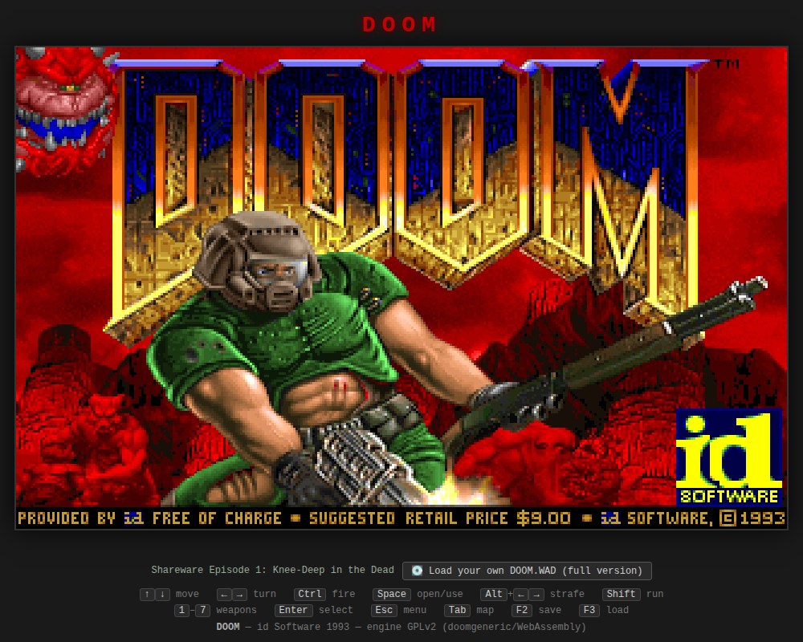
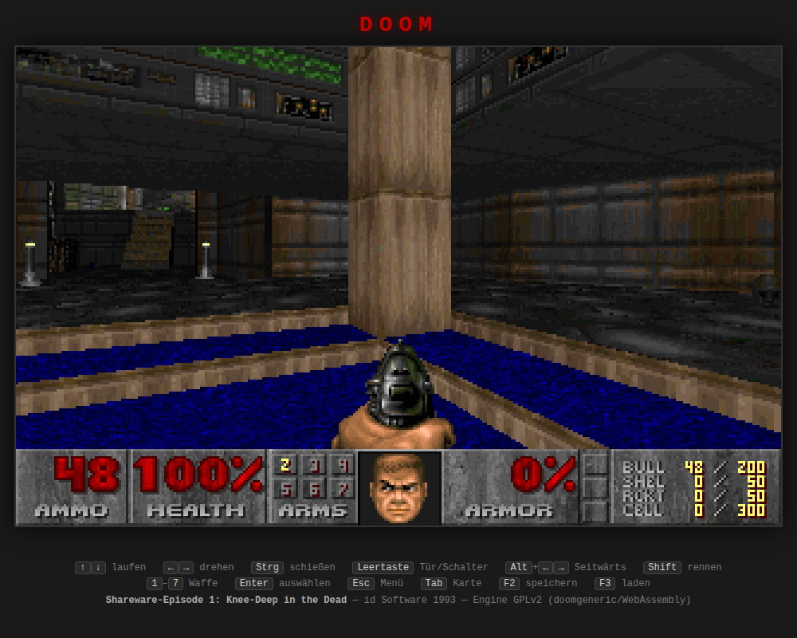

# 🔥 DOOM in einer HTML-Datei

```
 ██████╗   ██████╗   ██████╗  ███╗   ███╗
 ██╔══██╗ ██╔═══██╗ ██╔═══██╗ ████╗ ████║
 ██║  ██║ ██║   ██║ ██║   ██║ ██╔████╔██║
 ██║  ██║ ██║   ██║ ██║   ██║ ██║╚██╔╝██║
 ██████╔╝ ╚██████╔╝ ╚██████╔╝ ██║ ╚═╝ ██║
 ╚═════╝   ╚═════╝   ╚═════╝  ╚═╝     ╚═╝
        eine Datei · offline · echt
```

**Das echte DOOM (1993, id Software) — komplett in einer einzigen `index.html`.**

Kein Server. Kein Internet. Keine Installation. Keine Admin-Rechte.
Datei doppelklicken → Browser öffnet sich → spielen.

| | |
|---|---|
| 📦 **Eine Datei** | `index.html`, ~6 MB — Engine, WASM und WAD als Base64 eingebettet |
| 🖥️ **Läuft überall** | Chrome, Edge, Firefox — direkt von `file://`, auch vom USB-Stick |
| 🚫 **Null Netzwerk** | kein `fetch`, kein CDN, Network-Tab bleibt leer (getestet) |
| 🔓 **Keine Sonderrechte** | kein SharedArrayBuffer, keine COOP/COEP-Header, keine Threads |
| ⚖️ **100 % legal** | GPL-Engine + offizielle Shareware-WAD (frei verteilbar) |

---

## 📸 Screenshots

| Titelbildschirm | E1M1 — Hangar |
|---|---|
|  |  |

*Screenshots aus dem automatisierten Selbsttest: Chromium, geöffnet per `file://`, null Netzwerk-Anfragen.*

---

## 🚀 Schnellstart

1. `index.html` herunterladen (oder auf den USB-Stick kopieren)
2. Doppelklick
3. <kbd>Enter</kbd> drücken → **New Game** → Episode → Schwierigkeitsgrad
4. Willkommen in *Knee-Deep in the Dead*. Viel Glück, Marine. 💀

## 🎮 Steuerung (klassisch, wie 1993)

| Taste | Funktion |
|---|---|
| <kbd>↑</kbd> <kbd>↓</kbd> | Vorwärts / rückwärts |
| <kbd>←</kbd> <kbd>→</kbd> | Drehen |
| <kbd>Strg</kbd> | Schießen |
| <kbd>Leertaste</kbd> | Tür öffnen / Schalter |
| <kbd>Alt</kbd> + <kbd>←</kbd> <kbd>→</kbd> | Seitwärts (Strafe) |
| <kbd>Shift</kbd> | Rennen |
| <kbd>1</kbd>–<kbd>7</kbd> | Waffe wählen |
| <kbd>Esc</kbd> / <kbd>Enter</kbd> | Menü / auswählen |
| <kbd>Tab</kbd> | Automap |
| <kbd>F2</kbd> / <kbd>F3</kbd> | Speichern / Laden |

Cheat-Codes einfach eintippen — `iddqd`, `idkfa` &amp; Co. funktionieren. 😈

## 🧱 Wie es funktioniert

```
┌──────────────────────────── index.html ────────────────────────────┐
│                                                                     │
│  <canvas>  ← 640×400, image-rendering: pixelated                    │
│                                                                     │
│  <script id="wad-data">   DOOM1.WAD v1.9 (Base64, ~5,6 MB)          │
│  <script id="wasm-data">  Engine-Binärmodul (Base64, ~500 KB)       │
│                                                                     │
│  Bootstrap-JS   Base64 → Bytes → Module.wasmBinary + MEMFS-Datei    │
│  Tastatur-JS    keydown/keyup → DOOM-Keycodes → Key-Queue (C)       │
│  Render-JS      BGRA-Framebuffer → RGBA → putImageData()            │
│                                                                     │
│  Emscripten-Glue + WASM  =  originaler id-DOOM-Code (GPLv2)         │
│                             via doomgeneric, Mainloop @ 35 fps      │
└─────────────────────────────────────────────────────────────────────┘
```

- **Engine:** Der originale DOOM-Quellcode, den id Software unter der GPL
  veröffentlicht hat, über die Portierungsschicht
  [doomgeneric](https://github.com/ozkl/doomgeneric) mit Emscripten zu
  WebAssembly kompiliert.
- **Backend:** Eigenes, SDL-freies Plattform-Backend
  ([`build/doomgeneric_emscripten.c`](build/doomgeneric_emscripten.c)):
  direktes Canvas-Rendering, Tastatur-Ringpuffer, `emscripten_set_main_loop`
  mit 35 fps — exakt DOOMs interne Tickrate.
- **Spieldaten:** `DOOM1.WAD` v1.9, die offizielle Shareware-Episode 1
  (MD5 `f0cefca49926d00903cf57551d901abe`, 4.196.020 Bytes).

## 💿 Vollversion einbauen

Die Vollversion (`DOOM.WAD`) ist **nicht** enthalten — sie ist kommerzielle
Ware und darf nicht frei verteilt werden. Wer sie besitzt (z.&nbsp;B. aus der
Steam-/GOG-Version), lädt sie so:

**Einfachster Weg — der Knopf unter dem Spielfeld:**

1. `index.html` öffnen
2. **„💽 Eigene DOOM.WAD laden (Vollversion)"** klicken und die eigene
   `DOOM.WAD` auswählen
3. Das Spiel startet neu als Vollversion (auch *Ultimate Doom* mit
   Episode 4 funktioniert). Die WAD wird nur lokal im Browser
   (IndexedDB) gespeichert und verlässt den Rechner nicht.
   „↩ Zurück zur Shareware" macht es rückgängig.

**Alternativ fest einbacken** (überlebt auch Browser-Datenlöschung):

1. WAD zu Base64 kodieren — unter Windows:
   ```bat
   certutil -encode DOOM.WAD wad.b64
   ```
   (erste und letzte Zeile `-----BEGIN/END CERTIFICATE-----` entfernen)
2. In `index.html` den Inhalt des Blocks `<script id="wad-data">` durch den
   Base64-Text ersetzen.

Die Engine erkennt die Version automatisch am WAD-Inhalt.
*Hinweis: DOOM II (`DOOM2.WAD`) wird von diesem Build nicht unterstützt —
nur DOOM 1 / Ultimate Doom.*

## 🔨 Selbst bauen

Benötigt: `emscripten`, `python3`. Ablauf (siehe [`build/`](build/)):

```bash
# 1. doomgeneric-Quellcode holen und Backend einsetzen
cp build/doomgeneric_emscripten.c doomgeneric/doomgeneric/

# 2. Engine kompilieren  →  doom.js + doom.wasm
bash build/build.sh

# 3. Alles in eine HTML backen  →  index.html
python3 build/gen_html.py
```

## ❓ FAQ

**Warum kein Sound?**
Das Backend implementiert Grafik + Eingabe. Die Original-Soundmodule hängen
an SDL/SDL_mixer, das bewusst weggelassen wurde, um die Datei klein und
abhängigkeitsfrei zu halten. Das Spiel läuft davon unbeeindruckt.

**Bleiben Spielstände erhalten?**
<kbd>F2</kbd>-Speicherstände leben im Arbeitsspeicher der Seite und
überleben kein Neuladen. Für eine Sitzung reicht's.

**Ist das ein Klon wie Freedoom?**
Nein. Engine = originaler id-Quellcode (GPL). Daten = originale
Shareware-WAD von id Software. Das ist *das* DOOM.

## ⚖️ Lizenz

- **Engine:** GPLv2 — © id Software, Simon Howard (Chocolate Doom),
  ozkl (doomgeneric). Quellcode und Build-Skripte liegen in
  [`build/`](build/), Upstream: <https://github.com/ozkl/doomgeneric>
- **DOOM1.WAD:** © id Software 1993. Die Shareware-Version darf laut
  id Software unverändert frei weiterverteilt werden.
- *DOOM* ist eine Marke von id Software LLC.
